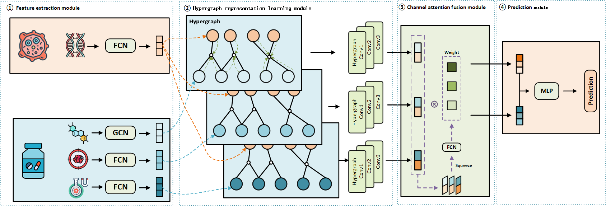

# MHGSynergy
This repository contains the code and data for "Multimodal hypergraph representation learning for drug synergy prediction"


# Requirements
* python 3.7
* deepchem >= 2.5
* numpy >= 1.19
* pandas >= 1.3
* pytorch >= 1.8.0
* pytorch geometric >= 2.0.0 
* scikit-learn >= 1.0.2
* rdkit >= 2020.09.1

# Usage
```sh
  cd Model/MHGSynergy
  # for classification experiment
  python main.py
  # for regression experiment
  python main_reg.py
```

# Contact
Author: Zheng Zhang  
Maintainer: Zheng Zhang  
Mail: m15629585255@163.com  

Corresponding author:  Xian-gan Chen
Mail:  chenxg@mail.scuec.edu.cn

Date: 2026-3-6  
School of Biomedical Engineering, South-Central Minzu University, China  


# Other
This code framework is modified based on the HyperGraphSynergy method.  
https://github.com/liuxuan666/HypergraphSynergy

Feel free to cite this work if you find it useful to you !

```python
@article{MHGSynergy,
    title = Multimodal hypergraph representation learning for drug synergy prediction,
    author = {Zheng Zhang, Tong Luo, Xian-gan Chen, Xiaofei Yang,  Jihong Gong},
    year = {2026},
    volume = {23},
    issue = {1},
    page = {518-527},
    journal = {IEEE Transactions on Computational Biology and Bioinformatics},
    doi = {10.1109/TCBBIO.2025.3648991},
}
```
